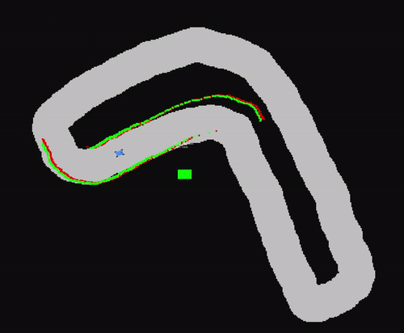

# LiDAR ICP Scan Matching
Localization using Iterative Closest Point Scan Matching for F1/10 autonomous car

Used a Point-to-Line metric for measuring error in transformation. 

Implementation based on "An ICP variant using a point-to-line metric, Andrea Censi, 2008"

http://citeseerx.ist.psu.edu/viewdoc/download?doi=10.1.1.329.6781&rep=rep1&type=pdf

